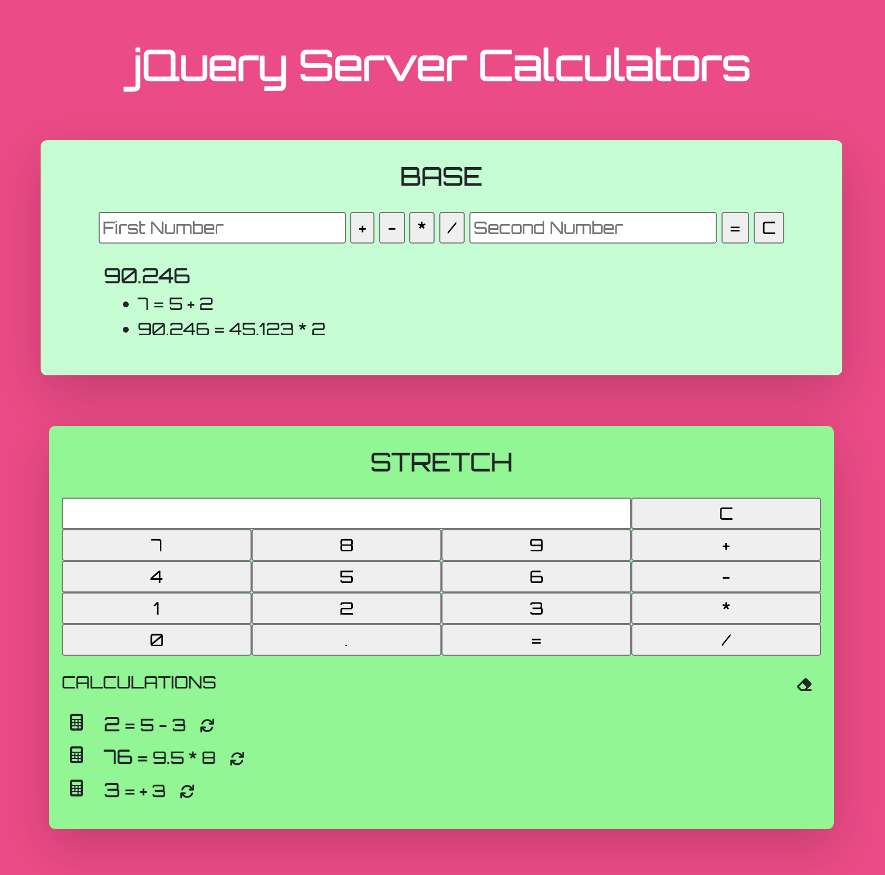

# jQuery Server Calculator

## Description

I created two server-side calculators. The base calculator takes in a first number and second number from input fields and an operator from a button click. The stretch calculator takes in input solely from button clicks. The value of the inputs for both calculators are stored in objects and sent to the server via a POST request from the client. Mathematical operations occur on the server, and the objects that now include a total property are stored there in an array. The client makes a GET request to the server, and the calculations with totals are appended back to the page as list items.

In the stretch calculator, there is an option to re-run a previously listed calculation. The client sends the number and operator inputs from the calculation that was clicked on to the server. The server checks the array of stored calculation objects for a match based on these inputs. When a match is found, the server sends that calculation object with total back to the client. This calculator also has a delete capability. The client makes a DELETE request by clicking on the eraser button. The server receives the request and empties the array of stored calculations. The client loops through the emptied array, and no items are appended back to the page. 

## Screen Shot

## To-Do List

### Part 1
- [X] Set up file structure
- [X] Source css, javascript, jQuery
- [X] Set up and test server
- [X] Create layout and inputs for base calculator
- [X] Create layout and inputs for stretch calculator
- [X] Add delete history and recalculate butttons for stretch calculator

### Part 2
- [X] Create click event handlers that get value of button clicked
- [X] Create object to store data from inputs
- [X] Display input in stretch calculation field

### Part 3
- [X] Make POST request to server to send base calculator object
- [X] Make GET request from server to get base calculation data
- [X] Make POST request to server to send stretch calculator object
- [X] Make GET request from server to get stretch calculation data
- [X] Display historical calculations on page load

### Part 4
- [X] Add conditionals to only allow entries when all inputs are provided
- [X] Make a DELETE request to server to remove stretch calculator data
- [X] Create a re-run calculation function for entry in stretch calculations history

